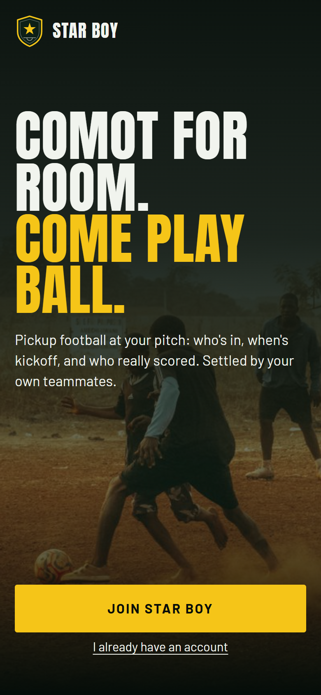
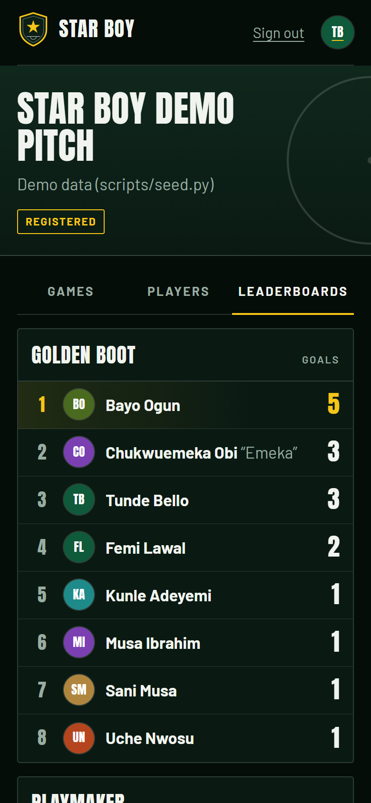
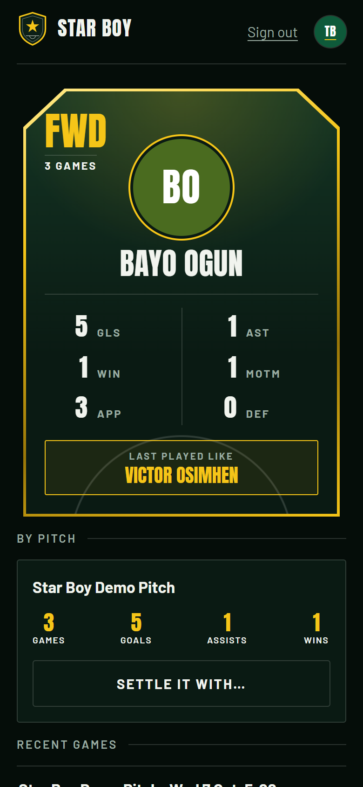

# Star Boy ⭐

**Star Boy gets people out of their rooms and onto the pitch.**

Every pickup football pitch becomes a small community: register at your pitch, set up a game, get reminded to show up, then tell Star Boy how it went with a voice note. Open-weight models (Whisper for speech, Gemma for understanding) turn the voice note into stats, your teammates confirm them, and the pitch leaderboards update.

> Built for the DEV Hacktoberfest Open-Source AI Challenge ("Touch Grass").

| Landing | Pitch leaderboards | Player card |
|---|---|---|
|  |  |  |

## What it does

- **Pitches:** register at your pitch, see who plays there, and the leaderboards: Golden Boot, Playmaker, Most MOTM, The Wall, Most Wins, Most Consistent.
- **Games:** set one up, invite players, answer "I'm in" or "Can't make it" in one tap. Reminders arrive on Telegram.
- **After the game:** tell Star Boy how it went with a **voice note**, or **tap your stats** with a few buttons. Teammates confirm before anything counts. The game's creator enters the final score once.
- **"You played like…":** each report earns a legend, picked by code from the stats (a hat-trick might make you Rashidi Yekini), with one line written by Gemma.
- **Settle it:** pick two players and get a decisive verdict from confirmed stats.
- **Share:** summaries, leaderboards and verdicts go to WhatsApp as clean text.

## How it is built

- **Frontend:** React 18 + Vite, plain CSS (a phone-first web app you can add to the Home Screen).
- **Backend:** FastAPI (Python), which also serves the built React app.
- **Database:** MongoDB Atlas (free M0 cluster), through the Motor async driver. Leaderboards and player stats are aggregation pipelines.
- **Telegram bot:** invites, reminders and post-game voice notes.
- **AI:** Gemma (understanding) and Whisper (speech). Where they run is one setting:

| `AI_MODE` | Gemma | Whisper | Use it for |
|---|---|---|---|
| `local` | Ollama on your computer (`gemma4:e2b-it-qat`) | faster-whisper on your CPU | Running fully offline from any AI service |
| `cloud` | Gemma 4 (`gemma-4-26b-a4b-it`) through the Gemini API free tier | Whisper large-v3 at Groq, free tier | Small free servers (Render), or a slow laptop |

Both modes use the same prompts and the same code checks. On this project's 2014 laptop a voice note takes a minute or more in local mode and about 8 seconds in cloud mode.

## How the AI is kept honest

- **Voice note to stats:** Whisper transcribes, Gemma extracts JSON, then code checks it: numbers must be 0 to 20, any number of 2 or more must appear in the transcript, the result and score must agree, and names must match players in that game.
- **Settle it:** code computes the comparison table from confirmed stats and picks the winner. Gemma only announces and explains it. Every number in its text must exist in the table and belong to the player it is given to. If not, it gets one retry, then a plain template is used.
- **"You played like…":** code picks the legend from the stats. Gemma only writes the one line, which may not invent a number or name a different player.
- **Game summaries:** same rule: every number must be in the facts the code collected.
- **Audio is never stored.** The file is deleted right after transcription; only the transcript is kept. In cloud mode the audio is sent to Groq to be transcribed, and the transcript to Google's Gemini API.

## Run it on Windows (PowerShell)

You need Python 3.12+, Node.js 20+ and a MongoDB Atlas connection string.

**1. Settings.** Copy `.env.example` to `.env` and fill it in. The file explains each line.

```powershell
Copy-Item .env.example .env
```

**2. Backend** (first time only: create the virtual environment and install).

```powershell
cd backend
python -m venv .venv
.\.venv\Scripts\Activate.ps1
pip install -r requirements-dev.txt
```

Then start it (every time):

```powershell
.\run.ps1
```

The API is now at http://localhost:8000. http://localhost:8000/api/health shows whether the database is reachable and which AI mode is on.

**3. Frontend**, in a second PowerShell window.

```powershell
cd frontend
npm install
npm run dev
```

Open http://localhost:5173.

**AI on the laptop.** For `AI_MODE=local`, install [Ollama](https://ollama.com) and run `ollama pull gemma4:e2b-it-qat`. For `AI_MODE=cloud`, put a free `GEMINI_API_KEY` ([Google AI Studio](https://aistudio.google.com/apikey)) and `GROQ_API_KEY` ([Groq console](https://console.groq.com/keys)) in `.env`.

## Telegram bot

1. Create a bot with [@BotFather](https://t.me/BotFather) and put its token in `.env` as `TELEGRAM_BOT_TOKEN=`.
2. Start the backend. On a laptop the bot uses **polling**, so nothing needs to be public.
3. In the web app, tap **Connect Telegram 🔔** on the Home screen and press **Start** in Telegram.

Bot commands: `/next`, `/report`, `/leaderboard`, `/help`. After a game, send the bot a voice note.

A bot can only be in one mode at a time. Once the app is deployed it registers a **webhook**, and from then on the laptop no longer receives Telegram messages. To check or switch:

```powershell
cd backend
python scripts/set_webhook.py --info     # what is set now
python scripts/set_webhook.py --delete   # back to the laptop (the deployed bot stops until its next restart)
```

## Deploy to Render (free)

Render's free web service has 512 MB of RAM and a fraction of a CPU, and it goes to sleep after 15 minutes without visitors. That is why no model runs on it (`AI_MODE=cloud`), and why step 5 matters.

**1. Put the code on GitHub.** Render deploys from a GitHub repository.

**2. Create the service.** In the [Render dashboard](https://dashboard.render.com): **New +** → **Blueprint** → connect GitHub and pick this repository. Render reads `render.yaml` and shows a form asking for the secret values.

**3. Paste the secrets.** Each box in that form takes the value after the `=` on the matching line of your `.env`:

| Box in Render | Where the value comes from |
|---|---|
| `MONGODB_URI` | your `.env` |
| `TELEGRAM_BOT_TOKEN` | your `.env` |
| `TELEGRAM_WEBHOOK_SECRET` | your `.env` |
| `CRON_TOKEN` | your `.env` |
| `GEMINI_API_KEY` | your `.env` |
| `GROQ_API_KEY` | your `.env` |

Click **Apply**. `AI_MODE`, `MONGODB_DB` and `SESSION_SECRET` are filled in for you. To change a value later: open the service → **Environment** → edit → **Save, rebuild, and deploy**.

If the Blueprint screen asks for a payment card, use **New +** → **Web Service** instead: pick the repository, Language **Docker**, Instance Type **Free**, and add the same variables (plus `AI_MODE` = `cloud`) under **Environment Variables**.

**4. Check it.** The first build takes a few minutes. Your address is shown at the top of the service page, like `https://starboy.onrender.com` (Render adds letters if the name is taken). Open `<your address>/api/health`. It should say:

```json
{"status": "ok", "db": "ok", "ai_mode": "cloud", "bot_mode": "webhook"}
```

If `db` is `error`, allow access from anywhere (`0.0.0.0/0`) under **Network Access** in MongoDB Atlas. The app registers the Telegram webhook by itself at every start; you don't need to set `PUBLIC_BASE_URL`.

**5. Keep it awake (this is what makes reminders work).** At [cron-job.org](https://cron-job.org) (free), create a cron job:

- **URL:** `<your address>/api/cron/tick?token=<your CRON_TOKEN>`
- **Schedule:** every 10 minutes

Each call keeps the server awake and sends any reminders that are due. If the server did sleep, anything due in the last 2 hours is still sent when it wakes.

**6. Test from two phones.** Sign up on both, connect Telegram on both, set up a game, answer the invite, then send the bot a voice note after "kickoff".

Free-tier limits to know: Render gives 750 instance-hours a month (enough for one always-on service), Groq allows 2,000 transcriptions a day, and the Gemini API limits requests per minute. Star Boy runs AI jobs one at a time with a gap between them and retries when told to slow down, so a burst of voice notes after a match queues up rather than fails.

## Reminders

A scheduler inside the app checks every minute and sends, through the Telegram bot: the night-before reminder (8 pm Lagos), a nudge 6 hours before to players who haven't answered, a 2-hours-before reminder, and "How was your game? 🎙️" 15 minutes after the final whistle.

## Demo data and tests

```powershell
cd backend
python scripts/seed.py             # one demo pitch, 10 players, 3 confirmed games
python scripts/seed.py --remove    # take it out again
python -m pytest                   # consensus rules, number checks, pipelines, scheduler
```

Demo data goes into its own database, `starboy_demo`, never the real one. To look at it, start the backend with `$env:MONGODB_DB = "starboy_demo"; .\run.ps1` and sign in with phone `0800 000 0001` to `0800 000 0010`, PIN `1234`. The database tests use another separate database, `starboy_test`.

## Credits

- Landing photo: [Kenechukwu Emmanuel on Pexels](https://www.pexels.com/photo/youth-playing-football-in-nigeria-at-sunset-30449603/), free to use under the Pexels licence. The file is stored in this repo (`frontend/public/img/`).
- Fonts: Anton and Barlow, from Google Fonts (SIL Open Font License).

## Run it with Docker

```powershell
docker build -t starboy .
docker run --rm -p 10000:10000 --env-file .env starboy
```

Open http://localhost:10000. The image has no models in it and always runs in cloud mode.
